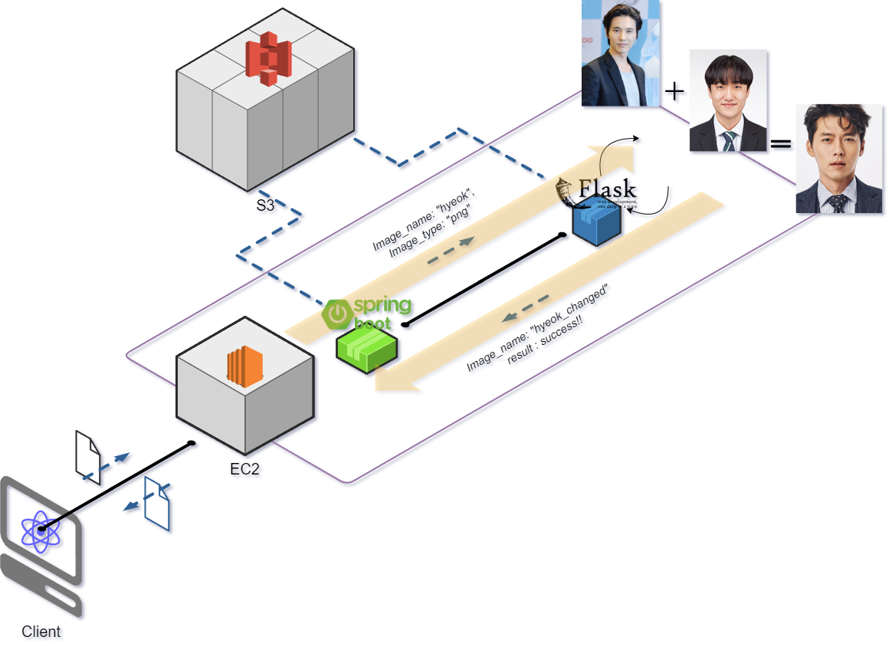
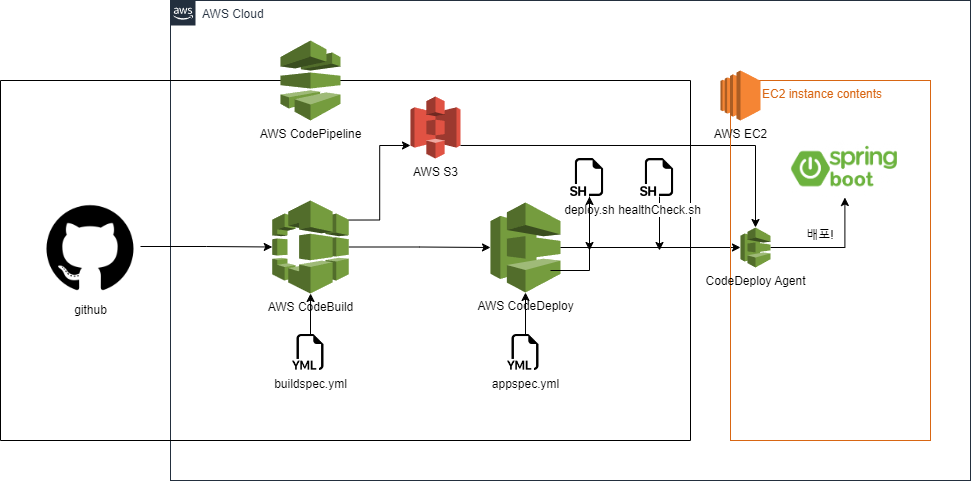

# Image_Change_Service
이미지를 S3에 담아서 변환 후 사용자에게 반환하는 백엔드 API 서버

# 프로젝트 핵심 기능
- 이미지 업로드 → AI 서버에서 변형 후 다운로드
- StyleGen 모델을 이용한 이미지 변환

# API 명세
| API 이름 |HTTP Method| URL                     |Type|RequestBody| ResponseType                                                                                               | ResponseBody                                             |
|--------|----|-------------------------|----|----|------------------------------------------------------------------------------------------------------------|----------------------------------------------------------|
| 이미지 변환 |POST| /api/image/image_change |multipart/form-data|image, imageFile.png| {  "message": "이미지를 정상적으로 변환하였습니다.",  "imageData": "iVBORw0KGgoAAAANSUhEUgAAB9AAAAPoCAIAAA”  } |

# flow chart

# 참조
프로젝트 참조

> CI/CD 구축
>  [Spring_SimpleAPI](https://github.com/baksakcci/Spring_SimpleAPI)

> AWS SDK for Java를 활용하여 S3에 접근
>   [Spring_S3Storage]()
>   => 이후 Spring Cloud AWS로 변경
> 